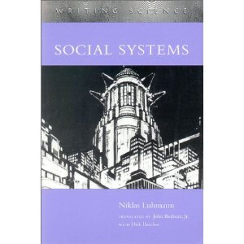

!SLIDE 
# Entity Systems #

!SLIDE smaller smbullets incremental
# What are Entity Systems? #

* "Entity system" is the name given to a collection of architecture patterns used to organise a game's "world"
* Origins in MMOs
* Like MVC, the term is used in subtly different ways by different people
* Goals - decrease coupling, increase (runtime) flexibility
* Key idea - separate data from behaviour

!SLIDE smbullets smaller
# Traditional Object-Centric Design #

    Player()
    
!SLIDE bullets smaller
# Traditional Object-Centric Design #

    Player(sprite)
    
!SLIDE bullets smaller
# Traditional Object-Centric Design #

    Player(sprite,position,direction,speed)

!SLIDE bullets smaller
# Traditional Object-Centric Design #

    Player(sprite,position,direction,speed,health)
    
!SLIDE bullets smaller
# Traditional Object-Centric Design #

    Player(sprite,position,direction,speed,health,treasure)

!SLIDE bullets smaller
# Adding items #

    Item(sprite,position,weight)
    
!SLIDE bullets smaller
# Refactor #

.notes Reasonable refactoring; let's extract `position` to a common base class

    GameObject(sprite,position)
        Player(direction,speed,health,treasure)
        Item(weight)
        
!SLIDE bullets smaller
# Let's add enemies #

.notes Ooft, that's just like a player, but it needs AI

    GameObject(...)
        Enemy(direction,speed,health,treasure)
    
!SLIDE bullets smaller
# Refactor #

    GameObject(position)
        LivingEntity(direction,speed,health,treasure)
            Player()
            Enemy()
        Item(weight)
        
!SLIDE bullets smaller
# Adding triggers... #

    GameObject(position)
        RenderableGameObject(sprite)
            LivingEntity(direction,speed,health,treasure)
                Player()
                Enemy()
            Item(weight)
        Trigger()
            TrapTrigger()
            DoorTrigger()

.notes let's add triggers to the world; we want to be able to open/close doors or triggers traps when players walk near them

!SLIDE bullets smaller
# Adding physics... #

    PhysicsObject(direction,speed,mass)
    
.notes Now let's add some physics; players should be able to push items about. We've already got the beginnings of this in LivingEntity, so let's extract a superclass to denote a moveable entity. LivingEntities gain mass, but that's fine because it's required by the physics system:
    
!SLIDE bullets smaller
# Adding physics... #

    GameObject(position)
        RenderableGameObject(sprite)
            PhysicsObject(direction,speed,mass)
                LivingEntity(health,treasure)
                    Player()
                    Enemy()
                Item()
        Trigger
            TrapTrigger()
            DoorTrigger()

!SLIDE bullets smaller
# Moveable trigger...? #

    GameObject(position)
        RenderableGameObject(sprite)
            PhysicsObject(direction,speed,mass)
                LivingEntity(health,treasure)
                    Player()
                    Enemy()
                Item()
        Trigger
            TrapTrigger()
            DoorTrigger()
            
.notes need to introduce moveable trigger
.notes but all moveable objects are renderable. trigger invisible.
          
!SLIDE bullets smaller
# Moveable trigger...? #

    GameObject(position)
        RenderableGameObject(sprite)            -- swap!
            PhysicsObject(direction,speed,mass) -/
                LivingEntity(health,treasure)
                    Player()
                    Enemy()
                Item()
        Trigger -- make subclass of PhysicsObject
            TrapTrigger()
            DoorTrigger()
            
!SLIDE bullets smaller
# Moveable trigger...? #
            
    GameObject(position)
        PhysicsObject(direction,speed,mass)
            RenderableGameObject(sprite)
                LivingEntity(health,treasure)
                    Player()
                    Enemy()
                Item()
            Trigger
                TrapTrigger()
                DoorTrigger()
                
.notes requirement accommodated - but now all triggers are physics objects.
.notes fine; immovable triggers can just have infinite mass.
.notes But what about collisions?
.notes a properly behaving physics system should surely STOP another object if it collides with an object having infinite mass. This will probably require a special case in the physics system.
                
!SLIDE smbullets incremental
# Inheritance #

As class hierarchy expands we're 
increasingly confronted with these problems.

* Elaborate hierarchy is inflexible
* Functionality gradually bubbles up to parent object
* Wasted memory
* Increased complexity - NULLs and special cases

.notes Elaborate hierarchy applies more to compiled languages; entities attributes are frozen at creation time; a ninja can never become a butterfly. bubbling functionality - negates benefits of OOP. Wasted memory == compiled languages NULLs - need placeholders for unused attributes. special cases as per physics example next up is mixins...

!SLIDE smbullets incremental
# Mixins #

* Great for dynamic languages
* Any game object may include any amount of optional functionality

!SLIDE smbullets smaller
# Mixins #

    @@@javascript
    function GameObject() { }
    GameObject.prototype = {
      addPhysics: function(props) {
        props = props || {};
        this.x = props.x || 0.0;
        this.y = props.y || 0.0;
        this.vx = props.vx || 0.0;
        this.vy = props.vy || 0.0;
        this.inverseMass = 1 / (props.mass || 1);
        this.distanceFrom = function(rhs) {
          // calculate distance from rhs and return
        }
      }
    }
    
.notes JS allows us to decorate objects at runtime

!SLIDE smbullets smaller
# Mixins #

    @@@javascript
    var obj = new GameObject();
    obj.addPhysics({x: 0, y: 0, });

!SLIDE smbullets incremental
# Mixins - Pros #

* No longer carrying around a bunch of extra cruft on objects that don't need it
* Can craft any type of object on the fly
* Don't need concrete classes for each combination (e.g. we can create a Monster by mixing in Physics, LivingEntity and AI)

!SLIDE smbullets incremental
# Mixins - Cons #

In the absence of a powerful type system still need to __check__ what we're dealing with:

    @@@javascript smaller
    function gameUpdate(delta) {
      allGameObjects.forEach(function(obj) {
        if (object.hasPhysics) {
          // do stuff
        }
        if (object.hasAI) {
          // do stuff
        }
      });
    }
    
!SLIDE
# Mixins #

What we've actually got here are the beginnings of a simple entity system.

!SLIDE smbullets small
# Detour - Autopoietic Systems #

* Autonomous, operationally closed
* Roots in biology
* Define nature of living systems

!SLIDE center small
# Detour - Niklas Luhmann #

!SLIDE smbullets smaller incremental
# Detour - Social Systems #

* Infinitely chaotic and complex environment
* Systems exist which operate upon environment
* System reduces complexity of environment
* Systems emerge from environment as required
* Systems are operationally closed
* Humans are not part of specific systems
* Society is a result of communication between humans

.notes Environment == world.  Systems e.g. legal system, economic system.  complexity reduction - through selection.  operational closure - systems do not know how other systems work.  humans not part of system - each system concerned with facets of human behaviour.  not enough for humans to merely exist - communication is necessary to create society

!SLIDE smbullets smaller incremental
# Back to Entity Systems #

!SLIDE bullets
# What is an Entity System? #

* Entities
* Components
* Systems
* World

!SLIDE bullets
# Entities #

* Represents any game object
* e.g. player, door, trigger, monster, gun-turret
* Just a (unique) integer ID

!SLIDE bullets
# Components #

* Describes a single facet of a single entity
* Usually map of attributes
* e.g. `physicsComponent = {x:0,y:0,vx:0,vy:0,mass:1}`
* max one component of a given type per entity
* __data only - no behaviour/logic__

!SLIDE bullets
# Entities/Components #

* Entity is bag of components
* Entity uses ID as primary key to look up components

!SLIDE bullets
# Systems #

* Implement one single game task
* e.g. physics, rendering, lifecycle
* Maintains a collection of components
* Acceptance check
* `update(delta)` method

!SLIDE bullets
# World #

* Container
* Query methods
* Lifecycle methods
* Message bus

!SLIDE bullets
# What is an Entity System? #

* Replace object-centric approach with data-centric approach

!SLIDE bullets incremental
# Entity System Benefits #

* Flexibile component composition
* Parallelism
* Serialisation
* Runtime modification

!SLIDE smbullets incremental small
# Runtime Modification - Pick up item #

* remove item's position component
* add `CarriedItem` component to item

!SLIDE smbullets incremental small
# Runtime Modification - Entity death #

* remove health component
* remove inventory component
* change animation component to death animation
* create new entity using entity's inventory/position components to represent dropped items

!SLIDE smbullets incremental
# Runtime Modification - Pick up item #

!SLIDE bullets
# Entity System Benefits #

* Flexibile component composition
* Parallelism
* Serialisation
* Runtime modification
* Tooling

!SLIDE bullets smaller
# Example - Bootstrapping #

    @@@javascript
    world = new World();
    world.addSystem(new PlayerInputSystem(world));
    world.addSystem(new PhysicsSystem(world));
    world.addSystem(new RenderingSystem(world));

.notes this is a simplification - in reality would need to configure systems

!SLIDE bullets smaller
# Example - Creating an Entity #

    @@@javascript
    entityId = world.createEntity();
    world.addComponent(entityId, {
        type:'physics', x:0, y:0, vx: 0, vy: 0, mass: 1
      });
    world.addComponent(entityId, {
        type: 'playerInput'
      });
    world.addComponent(entityId, {
        type: 'render', sprite: 'paddle'
      });
      
.notes next thing to do is add entity to the world
  
!SLIDE bullets smaller
# Example - Add Entity to World #

    @@@javascript
    world.addEntity(entityId);

!SLIDE smbullets smaller
# Example - World Lifecycle Events #

  * Adding entity to world triggers lifecycle event
  * Inform all systems of new entity
  * Other lifecycle events: delete entity, change entity, enable/disable entity

!SLIDE smbullets smaller
# Example - Game Update #

    @@@javascript
    setInterval(function() {
      world.update(40);
    }, 40);

!SLIDE smbullets smaller
# Example - Game Update #

    @@@javascript
    world.update = function(delta) {
      this._systems.forEach(function(system) {
        system.update(delta);
      });
    }
    
!SLIDE smbullets smaller
# Example - Physics System #

    @@@javascript
    function update(delta) {
      this._entities.forEach(function(entity) {
        var physics = this._manager.getComponent(
          entity, 'physics');
        physics.x += physics.vx * delta / 1000;
        physics.y += physics.vy * delta / 1000;
        physics.vx *= physics.damping;
        physics.vy *= physics.damping;
      });
      // resolve collisions
    }
    
!SLIDE smbullets
# Inter-System Communication #

Systems need to communicate:

* `PhysicsSystem` detects car hits wall at speed; `DamageSystem` must react
* `DamageSystem` detect character is dead. `InventorySystem` should drop treasure and `AnimationSystem` should play death animation

!SLIDE smbullets
# Inter-System Communication #

* Systems neither know about nor understand other systems
* i.e. system cannot lookup other system and call its methods
* Decouple systems
* Message passing
    
!SLIDE smbullets smaller
# Example - Inter-system Communication #

    @@@javascript
    function PhysicsSystem() {
      var self = this;
      this.update = function(delta) {
        
        var collisions = [];
        
        // do physics mojo...
        // ...
        // ...
        
        collisions.forEach(function(c) {
          // `c` is collision event object
          self.emit('collision', c);
        });
      }
    }
    
!SLIDE smbullets smaller
# Example - Inter-system Communication #

    @@@javascript
    function DamageSystem(world) {
      var self = this;
      world.on('collision', function(collisionEvent) {
        if (collisionEvent.speed > DAMAGE_THRESHOLD) {
          var cmp = self._manager.getComponent(
            collisionEvent.entity, 'health');
          cmp.health -= 10;
          if (cmp <= 0) {
            self.emit('entityDead', { ... });
          }
        }
      });
    }
    
!SLIDE smbullets small incremental
# Javascript Implementation Notes #

* 95% of games development in C++ is working around C++'s type system
* Dynamic typing == win
* Less code:
  * Don't need a class per event/component type - use JS objects
  * Closures for event handlers
* Construct entities deterministically to exploit V8's performance

!SLIDE smbullets small incremental
# Revisiting Entities #

* Entities as IDs is a throwback to statically-typed languages
* Attaching components to entities directly wastes space
* In Javascript, we can attach arbitrary attributes to objects at runtime
* Can make entity an object
* __Do not allow logic to seep in__

!SLIDE smbullets small incremental
# Entities as Objects #

    @@@javascript
    function Entity(id, manager) {
      this.id = id;
      this._manager = manager;
    }
    
    Entity.prototype.addComponent
      = function(name, cmp) {
          this[name] = cmp;
          // notify observers
        }
    
    entity.addComponent('physics', ...);
    
    // check for component
    if ('physics' in entity) {

!SLIDE smbullets
# Entities as Objects #

Helper methods:

    @@@javascript
    entity.hasComponent();
    entity.removeComponent();
    entity.removeAllComponents();
    
Keep it meta!

!SLIDE smbullets incremental
# Managing Determinism #

* Synchronisation Points
* Queues
* Asynchronous/synchronous events

.notes systems based on message passing can appear non-deterministic. need to ensure stuff happens in correct order. e.g. if entity "dies", need to make sure no systems try to access it after it's been removed from the world

!SLIDE smbullets incremental
# Optimisation #

!SLIDE smbullets incremental smaller
# Optimisation - Caching #

    @@@javascript
    function PhysicsSystem() {
        this._entities = {};
    
        this.update = function() {
            for (var entityId in this._entities) {
                var physicsComponent =
                  this._entities[entityId].getComponent('physics');
                // integrate position
            }
            // resolve collisions
        }
        
        this.entityAdded = function(entity) {
            this._entities[entity.id] = entity;
        }
        
        // entityRemoved
        // entityChanged
    }

!SLIDE smbullets incremental smaller
# Optimisation - Caching #

    @@@javascript
    function PhysicsSystem() {
        this._entities = {};
    
        this.update = function() {
            for (var entityId in this._entities) {
                var physicsComponent = this._entities[entityId];
                // integrate position
            }
            // resolve collisions
        }
        
        this.entityAdded = function(entity) {
            // store the physics component directly
            this._entities[entity.id] =
              entity.getComponent('physics');
        }
        
        // entityRemoved
        // entityChanged
    }

!SLIDE small
# Optimisation - Component Querying #

    @@@javascript
    function systemAcceptsEntity(entity) {
        return entity.hasComponent('physics')
                && entity.hasComponent('render')
                && entity.hasComponent('damage');
    }
    
Method call + hash lookup for each test
    
.notes Very common inside entity systems to need to known whether entity possesses combination of components.
E.g. system needs to check every entity that changes to decide whether or not it cares about it.

!SLIDE smaller
# Optimisation - Component Querying #

Idea: represent each type of component with a single bit.

    @@@javascript
    Components = {
        PHYSICS: 1,
        DAMAGE: 2,
        RENDER: 4,
        ...
    };
    
    entity = world.createEntity();
    entity.addComponent(Components.PHYSICS,{ ... });
    entity.addComponent(Components.RENDER, { ... });
    
    function Entity() {
        this._components = {};
        this._componentMask = 0;
    }
    
    Entity.prototype.addComponent = function(type, props) {
        this._components[type] = props;
        this._componentMask |= type;
    }
    
!SLIDE smaller
# Optimisation - Component Querying #

    @@@javascript
    Entity.prototype.hasComponent = function(mask) {
      return (this._componentMask & mask) == mask;
    }

    // check for a single component
    entity.hasComponent(Components.PHYSICS);

    // check for multiple components
    entity.hasComponent(Components.PHYSICS | Components.DAMAGE | Components.RENDER);

.notes guaranteed constant time operation

!SLIDE smaller smbullets
# Optimisation - Bit mask limitations #

  * Limited by the number of bits in the underlying data type
  * In Javascript, all numbers are represented by double precision floats
  * 53 byte mantissa == 53 components max
  * If this becomes problem, use an array-backed abstraction
  
!SLIDE smaller
# Optimisation - Event Handling #

    @@@javascript
    Events = {
        COLLISION_DETECTED: 1,
        PLAYER_DIED: 2,
        SOUND_EMITTED: 4
        ...
    }
    
.notes Similar to component optimisation. Same restrictions. However, probably going to have more than 53 events.

!SLIDE smaller smbullets incremental
# Optimisation - Event Handling #

    Role    <-- Category ---> <--------- Event ----------->
    Bit     16 15 14 13 12 11 10 09 08 07 06 05 04 03 02 01

  * Introduce event categories
  * Each event belongs to single category
  * Split up the bitfield
  * Each category gets unique bit
  * Each system specifies its category mask
  * Event is 10-bit integer
  * In Javascript, 43 bits for category + 10 bits for event number == 43 * (2^10) == ~44K event types
  
!SLIDE smbullets incremental
# Attribute/behaviour model #

  * Alternate approach to Entity Systems
  * Entity as collection of attributes and behaviour
  * Attributes can be observed and emit events on change
  * Behaviour responds to internal/external events
  * Behaviour emits events

!SLIDE smbullets incremental
# Attribute/behaviour model #

Further reading: 
 
Marcin Chady, Theory and Practice of Game Object Component Architecture (www.gdcvault.com/play/1911/)

!SLIDE smaller smbullets incremental
# Thought Experiment - Object Containment #

  * Entity Systems are cool but not a silver bullet
  * ES offer a flat view of the world
  * Not easy to represent hierarchy

!SLIDE smaller smbullets incremental
# Thought Experiment - Object Containment #

  * Consider a spacecraft with mount points for weapons
  * Both spacecraft and weapons are entities
  * How do we represent the mounting?
  
.notes issues - weapons rendered separately. but positioned relative to parent.
  
!SLIDE smaller smbullets incremental
# Thought Experiment - Object Containment #

  * Parent components?
  * Special case - `MountedObject` component?
  * Maybe the spacecraft is a `World` unto itself?

.notes parents - increased complexity. all systems need to deal with parents. is an object's position now relative to its parent? or should it update. special case - ok if only a couple of cases, but special cases don't scale. world unto itself - radical!

!SLIDE smaller smbullets incremental
# Thank you #

@jaz303 / github.com/jaz303